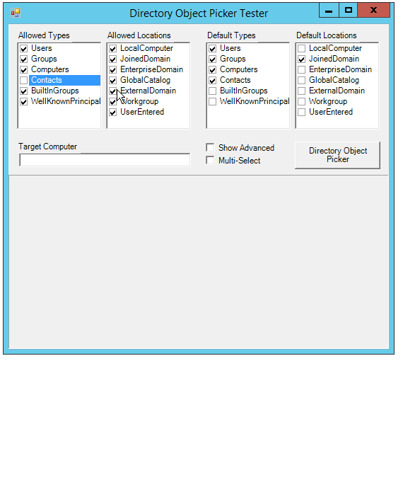

Active Directory Object Picker [](https://ci.appveyor.com/project/tulpep/active-directory-object-picker/branch/master)
========================
### The standard Active Directory object picker dialog for .NET




This project is based on a [Active Directory Common Dialogs .NET (ADUI)](https://adui.codeplex.com/) created in 2004 by Armand du Plessis. It has been updated and make it working with 64 bit Windows Editions.

### How to use it
You can install the lastest version using [NuGet](https://www.nuget.org/packages/Tulpep.ActiveDirectoryObjectPicker/)
```powershell
Install-Package Tulpep.ActiveDirectoryObjectPicker
```

And use it this way:
```cs
DirectoryObjectPickerDialog picker = new DirectoryObjectPickerDialog()
{
    AllowedObjectTypes = ObjectTypes.Computers,
    DefaultObjectTypes = ObjectTypes.Computers,
    AllowedLocations = Locations.All,
    DefaultLocations = Locations.JoinedDomain,
    MultiSelect = true,
    ShowAdvancedView = true
};


if (picker.ShowDialog() == DialogResult.OK)
{
    foreach (var sel in picker.SelectedObjects)
    {
        Console.WriteLine(sel.Name);
    }
}

```
This repository contains a Visual Studio Test Project if you want a working example.
